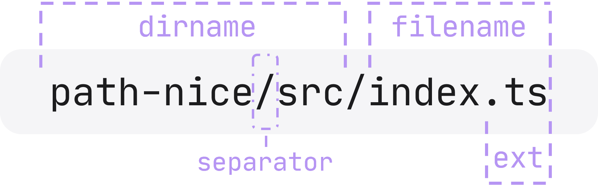

# path-nice

[English](README.md) | 简体中文

`path-nice` - `path` 与 `fs` 应有的设计.

如果有时你对 Node.js 的原装 `path` 与 `fs` 觉得不 nice, 那么只需


现有代码依然正常工作, 但 `path` 却已进化.

## Why this lib?

### 一个库搞定 `path` 与 `fs`, 还能大大缩短代码

原始版:

```ts
const src = path.resolve('./src');
await fs.promises.writeFile(
    path.join(src, 'index.ts'),
    'export default 42;',
);
```

nice 版:

```ts
const src = path('./src').toAbsolute();
await src.join('index.ts')
         .writeFile('export default 42;');
```

### 注释翔实, 文档不用翻, 例子全都有


### 支持指定其他 fs, 例如内存文件系统 [memfs](https://github.com/streamich/memfs)

```ts
import path from 'path-nice';
import { fs as memfs } from 'memfs';

const mpath = path
    .posix          // 使用 POSIX 风格的路径 (memfs 仅支持该风格)
    .bindFS(memfs); // 绑定文件系统

await mpath('/index.ts')
    .writeFile('export default 42;');
```

### 元编程加持, 路径是啥, 编译时就知道

(仅 POSIX 版本具有该能力)


## 安装

```shell
npm install path-nice
```

或者

```shell
yarn add path-nice
```

- 要求: Node.js >= v12.0.0
- 提供: CommonJS, ESModule 和 TypeScript typings
- ESModule 版本可以[直接在 Node 中使用](https://nodejs.org/api/esm.html#modules-ecmascript-modules).

## 3 分钟教程

> ⚠️ 这个库的 API 将在 2.0 版达到稳定, 在此之前请勿在生产中使用.

举例如下, 完整的用法请参考 [API Reference](https://fuuuoverclocking.github.io/path-nice/interfaces/Path.html).

在 `path` 后添加一对 `()` 以进入 "nice" 模式.

```ts
import path from 'path-nice'

const pkg = path('./package.json')

// 一个 PathNice 实例是对 raw path string 的包装,
// 用于方便地生成其他路径, 或操作文件
pkg.raw === './package.json'    // true

// 是 PathNice 的实例
pkg instanceof path.PathNice    // true

// 是一个不可变对象, 所有属性是只读的
Object.isFrozen(pkg)            // true
```

### Path 相关方法

<p align="center"></p>

```ts
const f = path('path-nice/src/index.ts')

// 以下 4 个方法: 0 个参数 = get, 1 个参数 = set

f.dirname()                     // path('path-nice/src')
f.dirname('another-dir')        // path('another-dir/index.ts')

f.filename()                    // 'index.ts'
f.filename('types.ts')          // path('path-nice/src/types.ts')

f.ext()                         // '.ts'
f.ext('.js')                    // path('path-nice/src/index.js')

f.separaotr()                   // '/'
f.separaotr('\\')               // path('path-nice\\src\\index.ts')

// .parent 是 .dirname() 的别名, 可获取父目录路径
f.parent.raw === f.dirname().raw // true

const f2 = f.parent.parent.join('package.json')
f2.raw                          // 'path-nice/package.json'

f2.prefixFilename('old.')       // path('path-nice/old.package.json')
f2.postfixBeforeExt('.old')     // path('path-nice/package.old.json')
f2.postfix('.old')              // path('path-nice/package.json.old')

f2.isAbsolute()                 // false
f2.toAbsolute()                 // path('/work/path-nice/package.json'), suppose cwd is '/work'
f2.toRelative('path-nice/docs') // path('../package.json')
await f2.realpath()             // path('/work/path-nice/package.json'), suppose cwd is '/work',
                                // and there are no symbolic links here.
f2.realpathSync()               // Sync ver

const parsedF2 = f2.toAbsolute().parse()

// 0 个参数 = get, 1 个参数 = set

parsedF2.root()                 // '/'
parsedF2.dir()                  // '/work/path-nice'
parsedF2.base()                 // 'package.json'
parsedF2.name()                 // 'package'
parsedF2.ext()                  // '.json'

parsedF2.dir('/home/fuu').ext('.md')
    .format()                   // path('/home/fuu/package.md')
```

### 文件系统相关方法

可以注意到, `fs` 模块中的函数, 例如 `readFile` 和 `writeFile`, 它们的第一个参数几乎都是 `path`, 如果
将它们改写成路径类的成员方法, 调用起来能够更加方便快捷.

下面大多数方法返回一个 `Promise`. 在函数名加上后缀 `Sync`, 即为它们的同步版本.

#### Read and write

- readFile
- readString: 等同于 readFile, 但保证返回 string, 默认 UTF-8
- readBuffer: 等同于 readFile, 但保证返回 Buffer
- readJSON: 读取文件, 再作为 json 解析
- writeFile
- writeJSON: 默认 UTF-8, 4 个空格缩进
- outputFile: 等同于 writeFile, 但如果文件目录不存在, 自动创建
- outputJSON
- updateString
  
  例如:

  ```ts
  path('README.md')
      .updateString(str => str.replace(/path/g, 'path-nice'))
  ```
- updateJSON
  
  例如:
  
  ```ts
  path('package.json')
      .updateJSON(json => { json.version = '1.0.0' })
  ```
- appendFile
- createReadStream
- createWriteStream
- open

#### Copy, move and remove

文件夹也可直接复制移动删除. 支持跨设备移动文件.

- copyAs: 复制为 ...
- copyToDir: 复制到文件夹内
- moveAs
- moveToDir
- remove
- rename
- emptyDir

#### Ensure

确保文件夹或文件存在, 如果不存在, 则自动创建.

- emptyDir
- ensureDir
- ensureFile

#### Is ... ?

- isDir
- isEmptyDir
- isFile
- isSymbolicLink
- exists

#### List directory contents

- ls: 返回 `Promise<{ dirs: PathNice[], files: PathNice[] }>`, 已经区分目录与文件, 且均为绝对路径, 用起来更省心
- readdir

#### Watch

- watch
- watchFile
- unwatchFile

#### Others

- chmod
- lchmod
- chown
- lchown
- stat
- lstat
