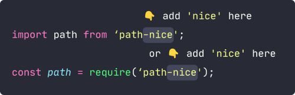

# path-nice

`path-nice` - How `path` and `fs` should be designed.

If sometimes you do not feel nice about `path` or `fs` of Node.js, then just




All existing code still works, while the `path` evolves.

## Installation

```shell
npm install path-nice
```

or

```shell
yarn add path-nice
```

- Requires: Node.js >= v12.0.0
- Provided: CommonJS, ESModule and TypeScript typings
- ESModule version can be [used directly in Node](https://nodejs.org/api/esm.html#modules-ecmascript-modules).

## Usage

> ⚠️ The API of this library will be stable in version 2.0, do not use it in production until then.

Add a pair of `()` after `path` to enter "nice" mode.

#### Path related methods

```ts
const a = path('path-nice/src')

a.raw                           // 'path-nice/src'

a.join('index.ts')              // path('path-nice/src/index.ts')

a.dotdot or .parent             // 👇 Same to .dirname()
a.dirname()                     // path('path-nice')
a.dirname('/work')              // path('/work/src')

a.filename()                    // 'src'
a.filename('docs')              // path('path-nice/docs')

const b = path('index.ts')

b.ext()                         // '.ts'
b.ext('.js')                    // path('index.js')
b.ext(null)                     // path('index')

const c = a.join(b)

c.prefixFilename('old.')        // path('path-nice/src/old.index.ts')
c.postfixBeforeExt('.old')      // path('path-nice/src/index.old.ts')
c.postfix('.old')               // path('path-nice/src/index.ts.old')

c.isAbsolute()                  // false
c.toAbsolute()                  // path('/work/path-nice/src/index.ts'), suppose cwd is '/work'
c.toRelative('path-nice/docs')  // path('../src/index.ts')

const d = c.toAbsolute().parse()

d.root()                        // '/'
d.dir()                         // '/work/path-nice/src'
d.base()                        // 'index.ts'
d.name()                        // 'index'
d.ext()                         // '.ts'

d.dir('/home/fuu').ext('.json').format()
                                // path('/home/fuu/index.json')
```


#### File system related methods

##### Sync ver

##### Read and write

```ts
.readFile
.readString
.readBuffer
.writeFile
.writeJson
.updateString
.updateJson
.appendFile
.createReadStream
.createWriteStream
.open
```

##### Copy, move and remove

```ts
.copyTo
.moveTo
.rename
.remove
.emptyDir
```

##### Ensure

```ts
.ensureDir
.ensureFile
```

##### Is ... ?

```ts
.exists
.isDir, isEmptyDir
.isFile
.isSymbolicLink
```

##### List directory contents

```ts
.readdir
.ls(recursive?: boolean, followlinks?: boolean): Promise<{
    dirs: PathNice[];
    files: PathNice[];
}>
```

##### Watch

```ts
.watch
.watchFile
```

##### Others

```ts
.stat
.chmod
.chown
```


### Real Case

This is the build script (`scripts/build.js`) of this library, which doesn't look nice (after all, we can't build it with itself) :

```js
const path = require('path');
const fs = require('fs');
const concurrently = require('concurrently');

const dirDist = path.resolve('./dist');

build();
async function build() {
    // clean
    fs.rmSync(dirDist, { recursive: true, force: true });

    // tsc concurrently
    // ...

    // cjs/esm fixup
    fs.writeFileSync(
        path.join(dirDist, 'cjs/package.json'),
        JSON.stringify({ type: 'commonjs' }, null, 4),
        { encoding: 'utf-8' },
    );
    fs.writeFileSync(
        path.join(dirDist, 'esm/package.json'),
        JSON.stringify({ type: 'module' }, null, 4),
        { encoding: 'utf-8' },
    );
}
```

Use `path-nice` instead:

```js
const path = require('path-nice');
const concurrently = require('concurrently');

const dirDist = path('./dist');

build();
async function build() {
    // clean
    await dirDist.remove();

    // tsc concurrently
    // ...

    // cjs/esm fixup
    await dirDist.join('cjs/package.json').writeJson({ type: 'commonjs' });
    await dirDist.join('esm/package.json').writeJson({ type: 'module' });
}
```